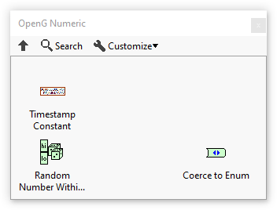

# OpenG Numeric Library

 

The OpenG Numeric Library package contains several routines for operating on numeric data.

## Installation

[Install the OpenG Numeric Library with VIPM](https://www.vipm.io/package/oglib_numeric/) (a.k.a oglib_numeric)

## How to Contribute

Take a look at the [Help Wanted](https://github.com/vipm-io/OpenG-Numeric-Library/issues?q=is%3Aissue+is%3Aopen+label%3A%22help+wanted%22) issues list. If it's your first contribution or you're not extremely familiar with this library, you might want to look at the [Good First Issues](https://github.com/vipm-io/OpenG-Numeric-Library/issues?q=is%3Aissue+is%3Aopen+label%3Agood+first+issue) list.  If you see an issue that looks like one you can complete, add a comment to the issue stating you'd like to work on it, and a maintainer will follow up and "assigned" to you. You then create a branch and then submit your contribution in the form of a [Pull Requests](https://github.com/vipm-io/OpenG-Numeric-Library/pulls).

## Contributors

<!-- ALL-CONTRIBUTORS-LIST:START - Do not remove or modify this section -->
<!-- prettier-ignore-start -->
<!-- markdownlint-disable -->
<table>
  <tbody>
    <tr>
      <td align="center" valign="top" width="14.28%"><a href="https://github.com/jimkring"> <b>Jim Kring</b></a> <a href="#code-jimkring" title="Code">💻</a> <a href="#test-jimkring" title="Tests">⚠️</a> <a href="#maintenance-jimkring" title="Maintenance">🚧</a></td>
      <td align="center" valign="top" width="14.28%"><a href="http://www.jgcode.net"> <b>Jonathon Green</b></a> <a href="#code-jg-code" title="Code">💻</a> <a href="#test-jg-code" title="Tests">⚠️</a> <a href="#maintenance-jg-code" title="Maintenance">🚧</a></td>
      <td align="center" valign="top" width="14.28%"><a href="https://github.com/Bas-vE"> <b>Basve</b></a> <a href="#maintenance-Bas-vE" title="Maintenance">🚧</a></td>
    </tr>
  </tbody>
</table>

<!-- markdownlint-restore -->
<!-- prettier-ignore-end -->

<!-- ALL-CONTRIBUTORS-LIST:END -->

